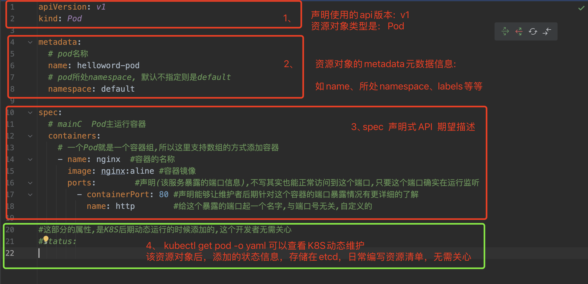

## 一、K8S资源对象

### 1、资源分类

#### 1、**k8s Namespace命名空间级别-资源**

工作负载型资源:  Pod、ReplicaSet、Deployment

服务发现和负载均衡:  Service、Ingress

配置与存储类型:  Volume、CSI

特殊类型的存储卷:   ConfigMap、Secret

#### 2、**cluster集群级别-资源**

Namespace、Node、ClusterRole、ClusterRoleBinding

#### 3、**元数据型-资源**

HPA、PodTemplate、LimitRange

### 2、资源清单yaml文件结构

## 二、Pod存在的容器分类

### 1、initC

特点:

​	1、与mainc定义container基本无差异

​	2、initC的执行顺序数**阻塞串行**， 执行顺序是依赖于initC的定义顺序, 只有前面的container的exit 退出码为0， 后续的initC才能继续执行,否则存在错误则整个执行顺序推倒重来， 直到整个initC都是exit 0， 才能进入mainC的运行

​	3、initC不需要长时间持久运行， 都需要exit退出码.  一般的应用场景， 可以做一些mainC要运行前的初始化脚本任务，就绪启动mainc检测脚本任务等等

​		1、例如， mainC需要拿到git仓库源代码运行. 那么可以设计initC执行任务，把git pull 拉取代码，进行mainC运行前的一些准备工作

​		2、依赖检测场景， 例如当前的mainC运行依赖mysql服务、nacos服务、redis服务等等， 那么如果没有initC来做依赖检测的话，如果这些服务未就绪，直接运行mainC肯定会报错，无法正常运行，导致无效的重启/重试.  如果这部分通过initC来检测， 检测都通过，再启动mainC， 更加优雅、也更加符合我们的预期

### 2、mainC

特点:

​	1、需要持久运行下去，持续不间断地提供服务，如常见的Nginx、Tomcat等，监听端口，提供HTTP服务

​	2、多个container容器的运行顺序是**并发的**, 非串行. 例如存在3个容器，那么这3个容器会同时进入启动状态，不会像initC一样串行阻塞

​	3、不需要退出码.  如果退出了证明容器存在异常情况，是我们不想看到的. 一般来说，我们希望容器都能正常、持续不间断地提供服务

