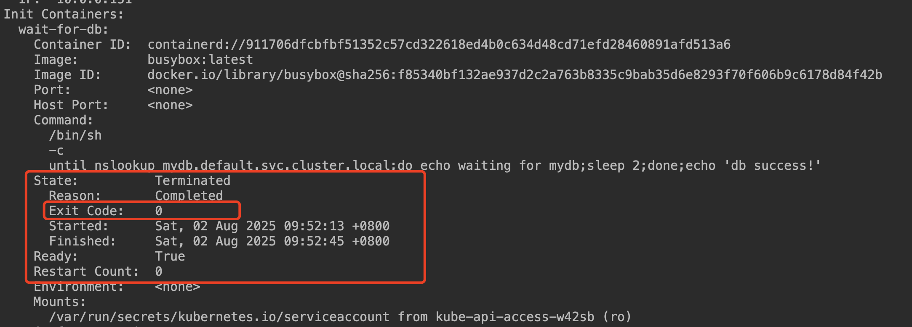
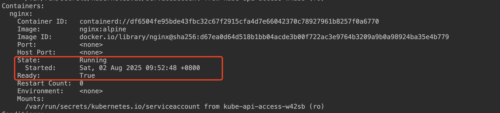
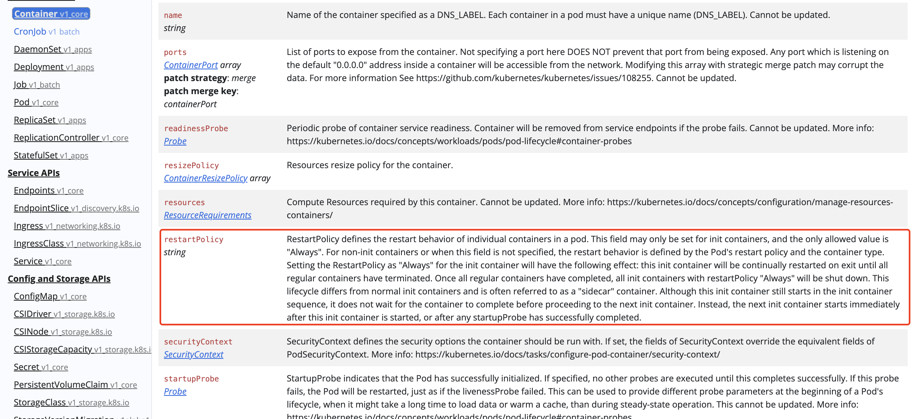
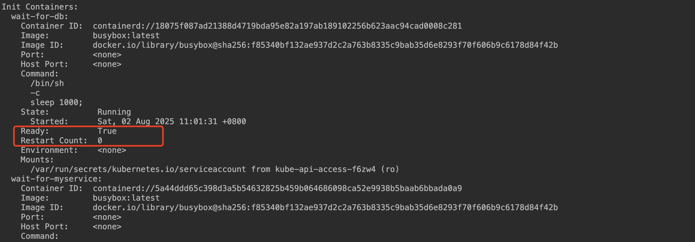

## 一、kubectl describe查看Pod容器exit退出码

1、通过describe命令，查看Pod的运行情况，可以查看initC各个容器的exit 退出码， 如果是0 则代表容器正常执行完毕，否则就是异常结束

```shell
kubectl describe pod pod-initc-mainc-1
```



2、同时也可以查看mainC容器的运行状态，退出码等信息



## 二、Pod状态

### 1、Pending

- **含义**：Pod 已被 Kubernetes 系统接受，但尚未完成所有初始化工作（如镜像拉取、调度到节点等）。
- 常见原因
  - 调度未完成（如资源不足、节点亲和性不满足）
  - 镜像拉取缓慢或失败
  - 初始化容器未完成

### 2、CrashLoopBackOff

在 Kubernetes 中，当 Pod 内的容器重启时（如因故障退出且 `restartPolicy` 为 `Always` 或 `OnFailure`），kubelet 会采用**退避策略（backoff）** 来控制重启间隔，避免频繁重启导致资源浪费。

**退避逻辑的固定性**：

- 初始延迟为 10 秒，每次失败后延迟翻倍（10s → 20s → 40s → ...）
- 当延迟达到 300 秒（5 分钟）后，不再继续增长，后续重启均保持此间隔
- 若容器稳定运行超过 10 分钟（无重启），退避计数器会重置为初始状态

### 3、Running

- **含义**：Pod 已被调度到某个节点，且至少一个容器处于运行状态（包括启动中）。
- **注意**：即使部分容器终止（如初始化容器完成后退出），只要有一个容器在运行，Pod 仍为 `Running` 状态。

### 4、Succeeded[job/CronJob]

- **含义**：Pod 中的所有容器均已成功终止，且不会被重启。
- **适用场景**：一次性任务（如 Job 管理的 Pod），完成后处于此状态。

### 5、Failed

- **含义**：Pod 中的所有容器均已终止，且至少一个容器因失败终止（退出码非 0）。
- **常见原因**：容器运行出错、被强制终止等

### 6、Unknown

- **含义**：Kubernetes 无法获取 Pod 的状态（通常因 Pod 所在节点与 API Server 通信故障）。
- **可能原因**：节点宕机、网络分区等

### 7、Terminated

 Pod正在被删除进入销毁状态

## 三、容器状态

### 1、Waiting(等待)

​	如果容器并不处在 `Running` 或 `Terminated`状态之一，它就处在 `Waiting` 状态。 处于 Waiting 状态的容器仍在运行它完成启动所需要的操作：例如， 从某个容器镜像仓库拉取容器镜像，或者向容器应用 Secret 数据等等。 当你使用 kubectl 来查询包含 Waiting 状态的容器的 Pod 时，你也会看到一个 Reason 字段，其中给出了容器处于等待状态的原因。

### 2、Running(运行中)

​	Running 状态表明容器正在执行状态并且没有问题发生。 如果配置了 postStart 回调，那么该回调已经执行且已完成。 如果你使用 kubectl 来查询包含 Running 状态的容器的 Pod 时， 你也会看到关于容器进入 Running 状态的信息。

### 3、Terminated(已终止)

​	处于 Terminated 状态的容器开始执行后，或者运行至正常结束或者因为某些原因失败。 如果你使用 kubectl 来查询包含 Terminated 状态的容器的 Pod 时， 你会看到容器进入此状态的原因、退出代码以及容器执行期间的起止时间。

​	如果容器配置了 preStop 回调，则该回调会在容器进入 Terminated 状态之前执行。

## 三、Pod内容器的重启策略(restartPolicy)

### 1、Always[默认,只要容器终止就自动重启容器]

默认情况下:  重启策略是Always (initC正常exit 0退出码除外， 只要容器退出，就会被重启)


<span style="color:red">initC容器，需要关注一个特点就是， 可能会重复执行， 要自己解决容器重启带来的幂等性问题！！！！！！</span>


### 2、OnFailure[只有在容器错误退出（退出状态非零）时才重新启动容器]

容器只有exit 退出码是非0， 才重启这个容器


### 3、Never[不会自动重启已终止的容器]

容器无论exit退出码如何 ，都不会重启容器


### 4、特殊情况: 只有initC容器可以设置restartPolicy, 且只能是Always

文档: https://kubernetes.io/docs/reference/generated/kubernetes-api/v1.32/#container-v1-core





特点:

​	1、不会阻塞后续的initC容器的运行， 遇到这个规则，启动后立即进入下一个 init container（不等待完成）

​	2、失败或退出后会不断重启

​	3、主容器等待所有 普通 init container 完成，但允许这个“常驻型”init container 一直运行

​	4、生命周期是“长期运行”的，像 sidecar

## 四、Pod容器的钩子Hook(lifecycle)

钩子可以通过以下几种方式来定义要执行的动作：

- **Exec**：在`容器内执行命令`。如果命令退出状态码为0，则认为成功；否则认为失败。
- **HTTP GET**：`kubelet` 组件 向指定的URL发起GET请求。如果返回的HTTP状态码在[200, 400)之间，则认为成功；否则认为失败。
- **TCP Socket**：`kubelet` 尝试与指定的socket建立连接。如果连接成功建立，则认为成功；否则认为失败。

### 1、postStart[容器启动后]

这个钩子在容器被创建后立即触发，但不能保证在容器的ENTRYPOINT之前执行。

如果PostStart钩子执行时间过长或挂起，则可能会阻止容器转换到running状态。  也就是存在postStart的钩子， 需要这个钩子执行结束，容器才能进入Running状态


### 2、preStop[容器停止前]

`preStop` 钩子和 `SIGTERM` 信号是并发执行的，而不是一个接一个地执行。这意味着你的应用程序需要能够同时处理这两者。

PreStop 钩子不会无限等待。默认先发送SIGTERM信号, 它的执行时间受到 Pod 的 terminationGracePeriodSeconds 限制，一旦超时，Kubernetes 会强制终止容器（发送 SIGKILL  -9 强杀）

周期由 Pod 的 terminationGracePeriodSeconds 字段控制，默认是 30 秒


