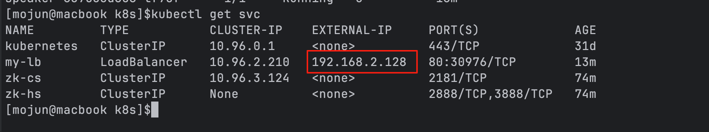

##  1、Service资源对象

Pod控制器还有:   1、StatefulSet   2、HPA      讲完Service之后再讲StatefulSet和HPA  理解上更加清晰

### 1、背景

​	我们的Pod可以通过各种控制器来解决不同场景下， Pod的一些运行特性。 例如Deployment 可以有效地保证Pod期望副本运行，以及支持滚动更新， DaemonSet控制每个Node节点有且只有运行1个Pod等等.

​	有了Pod控制器，我们再也不用担心Pod生命不稳定的情况了. 这些Pod控制器会自动监听Pod事件，尽最大努力地保障我们的Pod能够正常运行、提供服务.

​	但是现在，存在一个问题。  我们的Pod虽然能够提供服务， 集群内部也可以通过Pod分配到的集群的IP地址+端口进行访问。 但是还存在以下问题尚未解决:

​    <span style="color: red"> 1、如果在集群内部， A服务的pod要调用B服务的pod, 如何进行调用?   </span>

​				1.1  最简单的方式，就是A服务的Pod里面的代码将B服务的所有Pod的IP地址记录成为一个数组,  然后随机获取一个B服务Pod的IP地址进行调用.  但是，Pod随时可能重建， IP地址会变化， 难道每次变化，A服务的Pod的代码或者配置文件都改一遍?  改完再重启? 

​				1.2  那什么时候改呢?  因为Pod的重建是不确定了，这一秒还是好的，下一秒就重建了。 或者一个月都没重建。    管理员手动观察服务Pod，发生重建后，通知A服务去改代码? 

​				`问题很多，这样管理员都要累死， 并且服务也不稳定，效率低`

  <span style="color: red"> 2、如果是在集群外部,  集群外部的用户如何访问集群内部的Pod提供的服务呢?</span>

​				`我们在K8S部署的这些服务Pod， 大部分情况下最终还是要将服务提供给外部客户端进行访问，这样才有价值。    那怎么将服务提供给外部客户端进行调用呢?  怎么将外部流量导入进来呢?`


### 2、K8S的Service对象


​	为了解决上述问题， K8S提供的解决方案是Service对象.   Service对象能够给一组符合标签选择的Pod:

​	1、提供流量的负载均衡， 自动关联Pod后端IP地址， 自动移除异常的Pod的IP地址， 这个过程调用方无需关心，整个过程无感、透明

​    2、Service对象分配到的是一个集群的VIP(Virtual IP地址)， 客户端可以依赖这个固定的VIP地址，来实现固定访问. 访问这个固定的VIP地址，就能负载均衡访问到后端的Pod服务

​	3、还可以基于K8S的CoreDNS机制，通过域名解析得到Service的VIP地址，从而来访问Pod的服务. 不需要写死这个VIP地址， 依赖域名即可.

​	4、Service分为几种类型，作用于不同的应用场景:

​			1、默认类型 : ClusterIP   分配到一个VIP, 集群内通过VIP访问后端的pod服务

​			2、NodePort     每个集群节点(master+node)进行端口监听， 访问这个端口就能代理到集群的后端Pod服务

​			3、ExternalName   将外部域名集成到K8S集群内部Service资源, 基于DNS CNAME别名机制

​			4、Headless Service 无头服务

​			5、LoadBalancer    结合云厂商的LB提供服务

	### 3、K8S DNS域名规则

​	`[service-name].[namespace].svc.[cluster-domain]`

​    各部分含义如下：

- **`service-name`**：Service 的名称（由用户定义，需符合 Kubernetes 资源命名规范）。

- **`namespace`**：Service 所在的命名空间（默认命名空间为 `default`）。

- **`svc`**：固定标识，表明该域名指向的是 Service 资源。

- **`cluster-domain`**：集群的域名后缀（默认值为 `cluster.local`，可通过集群配置自定义）。

  

   service域名样例:  `my-svc.default.svc.cluster.local`    访问default命名空间下的my-svc完整域名

  ### 4、小试牛刀

1、定义一个server端的deployment, 存在2个副本Pod

2、为这个server端， 创建一个service进行关联， 访问这个service就可以负载均衡访问server的后端Pod

3、定义一个client端的deployment, 存在1个副本Pod


client客户端，可以基于VIP访问server端、基于域名访问、以及通过nslookup查看域名解析

```yaml
apiVersion: apps/v1
kind: Deployment
metadata:
  name: server-deploy
spec:
  replicas: 2
  selector:
    matchLabels:
      app: server   #标签: 服务端
  template:
    metadata:
      labels:
        app: server
    spec:
      containers:
        - name: whoami
          imagePullPolicy: IfNotPresent
          image: docker.m.daocloud.io/traefik/whoami
          ports:
            - containerPort: 80
              name: http
              protocol: TCP
---
apiVersion: v1
kind: Service
metadata:
  name: app-server     #定义一个service对象,service名称
spec:
  type: ClusterIP      #默认类型 ClusterIP  分配到一个集群的VIP地址
  selector:            #这个service要为哪些Pod做流量负载均衡、以及监听这些pod变化，自动注册后端IP、自动移除后端IP
    app: server
  ports:               #端口映射规则  port: 80 就是这个VIP的端口  targetPort:80 是映射后端的目的端口
    - port: 80
      targetPort: 80
---
apiVersion: apps/v1
kind: Deployment
metadata:
  name: client-deploy   #客户端deployment
spec:
  replicas: 1
  selector:
    matchLabels:
      app: client
  template:
    metadata:
      labels:
        app: client
    spec:
      containers:
        - name: busybox
          image: nginx:alpine   # 1、DNS解析测试(nslookup)  2、基于VIP的访问  3、基于域名的访问测试
          command:
            - "tail"
            - "-f"
            - "/dev/null"
```

 ## 2、Service分类


### 1、ClusterIP✅

#### 作用

ClusterIP 是默认的 Service 类型，会为 Service 分配一个**集群内部唯一的虚拟 IP（仅集群内可见）**，通过该 IP 和端口可访问后端关联的 Pod。其核心功能是：

- 为动态变化的 Pod（重启、重建后 IP 会变）提供**稳定的访问入口**；
- 自动对后端 Pod 进行**负载均衡**（默认轮询策略）。

#### 解决的问题

- Pod 的 IP 是动态的（由 kubelet 分配，重建后会改变），直接通过 Pod IP 访问不可靠；
- 集群内多个 Pod 提供同一服务时，需要统一入口和负载均衡能力。

#### 应用场景

- 集群内部服务通信

  ：适用于仅需要被集群内其他 Pod 访问的服务。例如：

  - 前端 Pod（如 Nginx）访问后端 API Pod（如 Spring Boot）；
  - 应用 Pod 访问数据库 Pod（如 MySQL 集群内的从库）。

#### 特点

- IP 仅在集群内部可访问，外部无法直接通过该 IP 访问；
- 可通过`spec.ports`配置端口映射（如将 Service 的 80 端口映射到 Pod 的 8080 端口）。

```yaml
apiVersion: v1
kind: Service
metadata:
  name: app-server     #定义一个service对象,service名称
spec:
  type: ClusterIP      #默认类型 ClusterIP  分配到一个集群的VIP地址
  selector:            #这个service要为哪些Pod做流量负载均衡、以及监听这些pod变化，自动注册后端IP、自动移除后端IP
    app: server
  ports:               #端口映射规则  port: 80 就是这个VIP的端口  targetPort:80 是映射后端的目的端口
    - port: 80
      targetPort: 80
```

####  内部、外部流量访问策略

1、`externalTrafficPolicy`只能用于具备接受外部流量的service: 如NodePort、LoadBalancer  ,  `internalTrafficPolicy`  3种service都支持

2、这两个参数只有`Cluster`、`Local` 的选择填写， 默认都是`Cluster`

3、`Cluster`表示会进行负载均衡，路由的后端pod可能在本节点、也可能在其他节点(跨节点).  `Local` 则表示如果本节点有服务的Pod则使用本节点的Pod(不跨节点转发)， 如果本节点不存在Pod则报错

### 2、NodePort✅

#### 作用

NodePort 在 ClusterIP 基础上，会在**集群所有节点上开放一个静态端口（默认范围 30000-32767）**，外部流量可通过「节点 IP:NodePort」访问 Service，再转发到后端 Pod。其核心功能是：

- 提供**集群外部访问入口**（基于节点 IP 和固定端口）；
- 继承 ClusterIP 的负载均衡能力（先通过 NodePort 进入节点，再转发到 ClusterIP，最后到 Pod）。

#### 解决的问题

- ClusterIP 仅集群内可见，外部客户端（如用户浏览器、集群外服务）无法访问；
- 需要简单、低成本地暴露服务到集群外（无需复杂负载均衡器）。

#### 应用场景

- 开发 / 测试环境

  ：快速暴露服务供外部调试。例如：

  - 开发者在本地通过「节点公网 IP:30080」访问集群内的测试 Web 应用；
  - 外部工具（如 Postman）通过 NodePort 调用集群内的 API 服务。

- 小规模生产场景：当集群节点 IP 固定且外部流量较小时，可直接用 NodePort 暴露服务。

#### 特点

- 端口范围固定（可通过 kube-apiserver 配置修改），需避免端口冲突；
- 外部访问需知道至少一个节点的 IP（若节点有公网 IP，可直接用公网 IP 访问）；
- 本质是在每个节点上启动一个代理，将 NodePort 的流量转发到 ClusterIP。

```yaml
apiVersion: v1
kind: Service
metadata:
  name: app-server     #定义一个service对象,service名称
spec:
  type: NodePort      #默认类型 ClusterIP  分配到一个集群的VIP地址
  selector:            #这个service要为哪些Pod做流量负载均衡、以及监听这些pod变化，自动注册后端IP、自动移除后端IP
    app: server
  ports:               #端口映射规则  port: 80 就是这个VIP的端口  targetPort:80 是映射后端的目的端口
    - port: 80
      targetPort: 80
      nodePort: 30080
```


### 3、ExternalName✅

#### 作用

ExternalName 是一种特殊的 Service，**不关联任何 Pod**，而是通过`spec.externalName`将 Service 映射到一个**外部域名（FQDN，如[db.example.com](https://db.example.com/)）**。当集群内 Pod 访问该 Service 时，DNS 会返回外部域名的 CNAME 记录，最终访问外部服务。其核心功能是：


- 为集群内 Pod 访问**外部服务**提供统一的内部访问入口；
- 隔离外部服务的域名变化（只需修改 Service，无需修改 Pod 配置）。

#### 解决的问题

- 集群内 Pod 直接硬编码外部服务域名（如`db.example.com`），当外部域名变更时，需修改所有 Pod 的配置，维护成本高；
- 需统一管理集群内对外部服务的访问（如权限控制、日志审计）。

#### 应用场景

- 访问集群外的第三方服务

  ：例如：

  - 集群内的应用 Pod 需要访问外部的云数据库（如 AWS RDS 的域名`mysql-rds.example.com`），通过 ExternalName Service`db-service`映射，Pod 只需访问`db-service`即可；
  - 访问外部 API 服务（如支付网关`payment.example.com`），通过 Service 统一管理域名。

#### 特点

- 不需要选择器（`selector`），因为不关联 Pod；
- 依赖集群 DNS（如 CoreDNS）解析，需确保 DNS 配置正常；
- 仅支持域名映射，不支持 IP（若外部服务是 IP，需先绑定域名）。

### 4、HeadLess Service[无头服务] ✅

#### 作用

HeadLess Service 通过设置`spec.clusterIP: None`禁用虚拟 IP，**不分配 ClusterIP**。当查询该 Service 的 DNS 时，会直接返回**所有关联 Pod 的 IP 地址列表**（而非统一入口）。其核心功能是：


- 暴露后端 Pod 的真实 IP，让客户端直接与 Pod 通信；
- 提供 Pod 级别的服务发现（客户端可自行决定如何访问 Pod）。

#### 解决的问题

- 标准 Service（如 ClusterIP）会隐藏 Pod 的真实 IP，无法满足客户端直接访问特定 Pod 的需求（如分布式系统的节点通信）；
- 有状态应用（如数据库集群、ZooKeeper）需要固定的网络标识和 Pod 间直接通信。

#### 应用场景

- 有状态应用（StatefulSet）：StatefulSet 管理的 Pod 会生成固定的名称（如`web-0`、`web-1`）和 DNS 记录（如

  ```
  web-0.nginx.default.svc.cluster.local
  ```
  
  ），HeadLess Service 可配合 StatefulSet 实现 Pod 间的稳定通信。例如：

  - Kafka 集群：Broker 节点需要相互发现并直接通信；
  - ZooKeeper 集群：节点间需要通过真实 IP 进行选举和数据同步。
  
- **客户端侧负载均衡**：客户端（如服务网格的 Sidecar）获取所有 Pod IP 后，自行实现负载均衡策略（如一致性哈希）。

#### 特点

- 无虚拟 IP，DNS 查询直接返回 Pod IP 列表；
- 支持选择器（关联 Pod）或不支持（配合 ExternalName 使用）；
- 常与 StatefulSet 结合，为有状态应用提供稳定的网络标识。

### 5、LoadBalancer ✅

#### 作用

LoadBalancer 是云厂商托管环境（如 AWS、GCP、Azure）特有的 Service 类型，会自动调用云厂商的 API 创建一个**外部负载均衡器**（如 AWS ELB、GCP Load Balancer），外部流量通过负载均衡器转发到 Service，再到后端 Pod。其核心功能是：

- 提供**生产级别的外部访问入口**（高可用、自动扩缩容的负载均衡器）；
- 自动管理负载均衡器与集群的关联（如动态更新后端 Pod IP）。

#### 解决的问题

- NodePort 的端口范围有限，且依赖节点 IP（节点故障会导致服务不可用）；
- 生产环境需要高可用的外部流量入口，支持自动故障转移和负载均衡。

#### 应用场景

- 生产环境外部服务暴露, 适用于需要通过公网访问的服务，例如：
  - 互联网用户访问的 Web 应用（如电商网站），通过云厂商负载均衡器分发流量；
  - 外部系统（如合作方 API）访问集群内的微服务，通过负载均衡器确保高可用。

#### 特点

- 依赖云厂商的负载均衡器服务，本地集群（如 Minikube）可能仅模拟实现；
- 负载均衡器的 IP 是外部可见的（通常是公网 IP）；
- 可通过`spec.loadBalancerIP`指定负载均衡器的 IP（需云厂商支持）。

#### MetalLB本地模拟LoadBalancer实验

```bash
kubectl edit configmap -n kube-system kube-proxy

修改:
mode: "ipvs"
ipvs:
  strictARP: true

```

```bash
官网: https://metallb.io/

wget https://raw.githubusercontent.com/metallb/metallb/v0.15.2/config/manifests/metallb-native.yaml

修改镜像地址, 全局替换:
quay.io   更改为  quay.nju.edu.cn     国内加速


最后执行:  kubectl apply -f metallb-native.yaml

查看运行是否正常:kubectl get pods -n metallb-system

```


执行IP池规则:  kubectl apply -f ip-config.yaml

```yaml
apiVersion: metallb.io/v1beta1
kind: IPAddressPool
metadata:
  name: first-pool
  namespace: metallb-system
spec:
  addresses:
  - 192.168.2.130/28  #Loaderbalancer的IP地址池
---
apiVersion: metallb.io/v1beta1
kind: L2Advertisement
metadata:
  name: example
  namespace: metallb-system
spec:
  ipAddressPools:
  - first-pool
```


执行创建service:

```yaml
apiVersion: v1
kind: Service
metadata:
  name: my-lb
spec:
  type: LoadBalancer   #指定为LoadBalancer 类型
  ports:
    - port: 80
      targetPort: 80
  selector:
    app: nginx
---
apiVersion: apps/v1
kind: ReplicaSet
metadata:
  name: test-pod
  labels:
    app: nginx
spec:
  replicas: 2
  template:
    metadata:
      labels:
        app: nginx
    spec:
      containers:
        - name: nginx
          image: nginx:alpine
  selector:
    matchLabels:
      app: nginx

```




