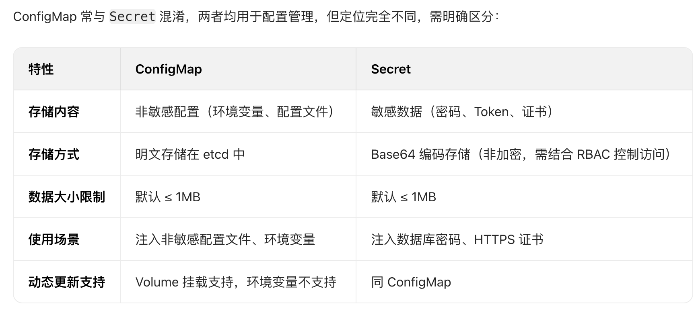

#  一、配置中心

​	Pod可能存在多个副本， 如果我们采取传统的配置文件的方式， 那么每次更新配置，需要针对所有pod的配置文件进行更新， 1个还好， 10个呢? 100个呢?  显然人工更新成本很高， 并且，Pod容器一旦销毁，那么重建的Pod配置文件又需要再次配置.

​	就算我们可以编写脚本的方式做到， 但是不够优雅。 K8S本身就针对此类场景，提供了相关的资源对象

## 1、configmap

### 1、简介

​	在 Kubernetes（k8s）集群中，**ConfigMap** 是核心的配置管理资源，用于存储**非敏感的配置数据**（如配置文件、环境变量、命令行参数等），实现 “配置与容器镜像解耦”，避免将配置硬编码到应用代码或镜像中，大幅提升应用部署的灵活性和可维护性。

### 2、核心价值

- **解耦配置与镜像**：镜像仅包含应用程序本身，配置通过 ConfigMap 动态注入，同一镜像可在不同环境（开发、测试、生产）中使用不同配置，无需重新构建镜像。
- **集中管理配置**：所有非敏感配置统一存储在 ConfigMap 中，便于版本控制和批量更新，避免分散在多个部署文件中。
- **安全隔离敏感数据**：与存储敏感信息的 `Secret` （如密码、Token）形成互补，明确区分 “非敏感配置” 和 “敏感数据”，降低误暴露风险。

### 3、设计限制

- **不存储敏感数据**：ConfigMap 中的数据以明文形式存储在 etcd（k8s 后端数据库）中，且容器内可直接读取，禁止用于存储密码、密钥等敏感信息（此类场景需用 `Secret`）。
- **数据大小限制**：单个 ConfigMap 的数据总量默认不超过 **1MB**（受 etcd 单键值对大小限制），避免存储过大配置文件（如日志模板、静态资源等）。

### 4、数据结构

ConfigMap 的核心是 “键值对（key-value）” 数据，支持两种数据类型，可在 YAML 定义中通过不同字段区分：

| 字段         | 作用                         | 适用场景                          | 示例                           |
| ------------ | ---------------------------- | --------------------------------- | ------------------------------ |
| `data`       | 存储**字符串格式**的配置数据 | 环境变量、短配置项（如端口、URL） | `log_level: "info"`            |
| `binaryData` | 存储**二进制格式**的配置数据 | 二进制文件（如证书、图片）        | 需用 Base64 编码（如证书内容） |

#### 1、环境变量-挂载方式

可以作为环境变量value的来源， 选择对应configmap的key的value，作为环境变量的value

#### 2、文件-挂载方式

可以作为volume的存储介质， 提供给Pod进行挂载配置文件

### 5、注意事项

#### 1、通过ENV方式挂载,configmap修改，不会更新ENV的值，除非重建Pod

#### 2、通过文件方式挂载,configmap修改，会存在时间差才更新Pod的文件内容，而不是立即更新

#### 3、configmap更新文件内容，不负责Pod重启或者热加载，是否热加载取决于Pod本身程序的功能,与configmap无关

#### 4、subPath方式挂载， 更新configmap，Pod内容器不会自动更新. 只有完整挂载configmap才会更新


## 2、secret

### 1、简介

​	在 Kubernetes（k8s）中，**Secret** 是一种用于存储和管理集群中**敏感信息**的资源对象，例如密码、令牌、API 密钥、TLS 证书等。它的核心作用是避免将敏感数据直接硬编码到容器镜像、Pod 配置文件或代码中，从而提升应用的安全性。

​	与 ConfigMap（用于存储非敏感配置，如环境变量、配置文件）相比，Secret 的核心差异在于**数据加密存储**（默认基于 Base64 编码）和**访问权限控制**，更适合处理敏感信息。

### 2、核心价值

1. **敏感数据隔离**：将敏感信息与应用代码、配置文件解耦，避免泄露风险。
2. **Base64 编码存储**：Secret 中的数据默认通过 Base64 编码（注意：Base64 是编码而非加密，生产环境需额外配置 etcd 数据加密，防止数据在存储层泄露）。
3. **细粒度访问控制**：通过 Kubernetes RBAC（基于角色的访问控制）限制哪些用户 / 组件可以读取 Secret。
4. **多种挂载方式**：支持通过 **环境变量** 或 **Volume 卷挂载** 两种方式注入到 Pod 中，供容器内应用使用。
5. **不可变特性（Immutable）**：支持标记为 `immutable: true`，一旦创建无法修改（需删除重建），进一步防止意外篡改（同 ConfigMap 的不可变特性）。

### 3、数据结构

secret 的核心是 “键值对（key-value）” 数据，支持两种数据类型，可在 YAML 定义中通过不同字段区分：

| 字段       | 作用                                                   | 示例                       |
| ---------- | ------------------------------------------------------ | -------------------------- |
| `data`     | 存储base64**字符串格式**的配置数据                     | base64_key: "aGVsbG8gazhz" |
| stringData | 存储明文字符串，创建后会自动base64编码，合并到data字段 | base64_key: "hello k8s"    |

#### 1、环境变量-挂载方式(同configmap)

#### 2、文件-挂载方式(同configmap)

### 4、注意事项(同configmap)

### 5、数据类型

#### 1、Opaque [默认类型]

 存储场景的key-value的secret,  value是base64字符串

#### 2、kubernetes.io/dockerconfigjson[存储拉取镜像的镜像仓库认证信息]

 我们在生产环境或者某些环境下， Pod拉取的镜像image需要进行认证才能拉取, 那么这个secret类型可以存储镜像仓库的认证信息， 如仓库地址、仓库的用户名、仓库的密码.

可以在Pod conatiner配置拉取秘钥secret， 这样才能拉取到image.

```yaml
type: kubernetes.io/dockerconfigjson
data:
	.dockerconfigjson:  "eyJhdXRocyI6eyJyZWdpc3RyeS5jbi1jaGVuZ2R1LmFsaXl1bmNzLmNvbSI6eyJhdXRoIjoiY205dmREcHliMjkwTVRJeiJ9fX0="
	
	这个base64字符串是个json字符串， 格式如下:
	{
	"auths": {
		  "registry.cn-chengdu.aliyuncs.com": {      #镜像仓库地址
			   "auth": "cm9vdDpyb290MTIz"              #  base64_encode("$username:$password")  root:root123
		   }
	  }
  }
```

pod进行引用:

```yaml
apiVersion: v1
kind: Pod
metadata:
  name: my-pod
spec:
  containers:
    - name: nginx
      image: nginx:alpine
  imagePullSecrets:       #拉取镜像要使用的secret
    - name: docker-secret #secret的名称
```


## 3、configmap与secret的区别

